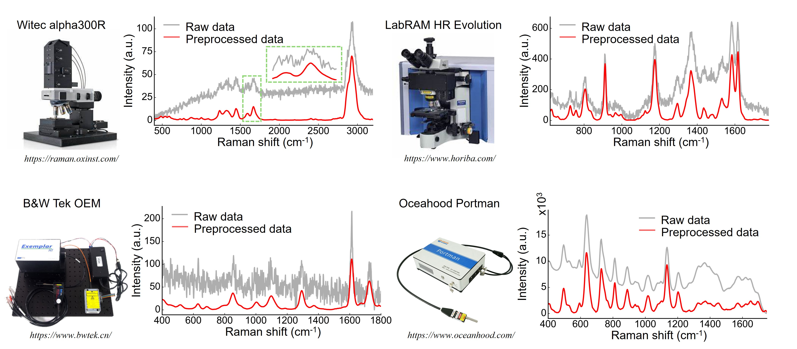
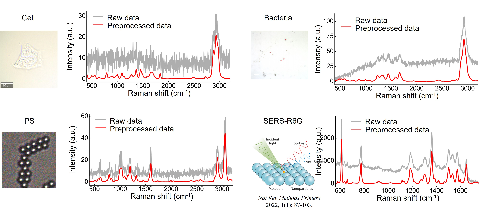
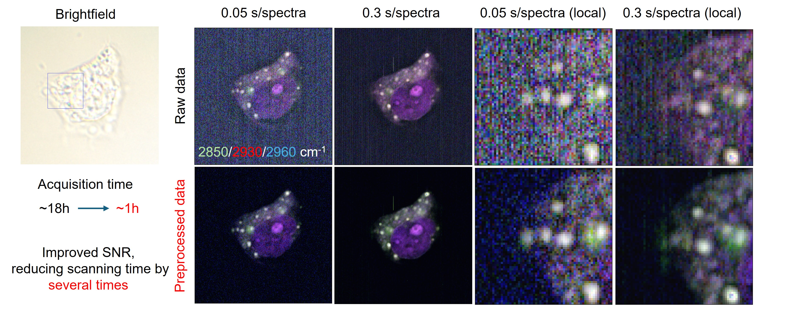
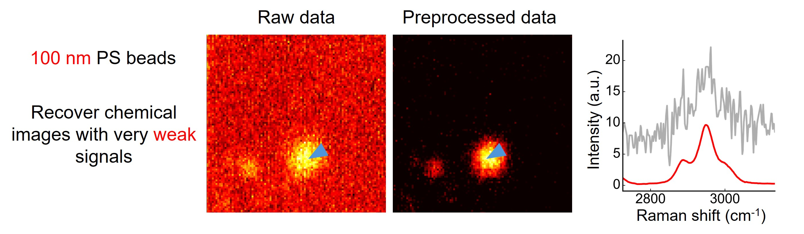
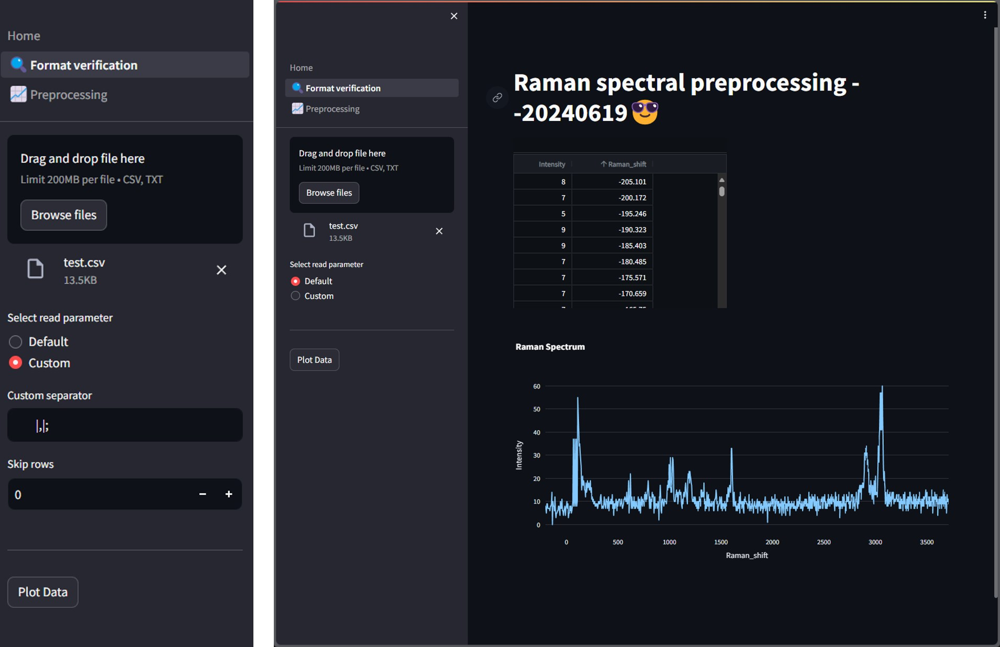
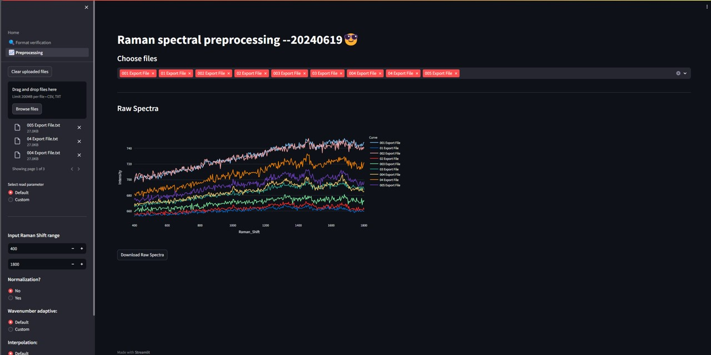
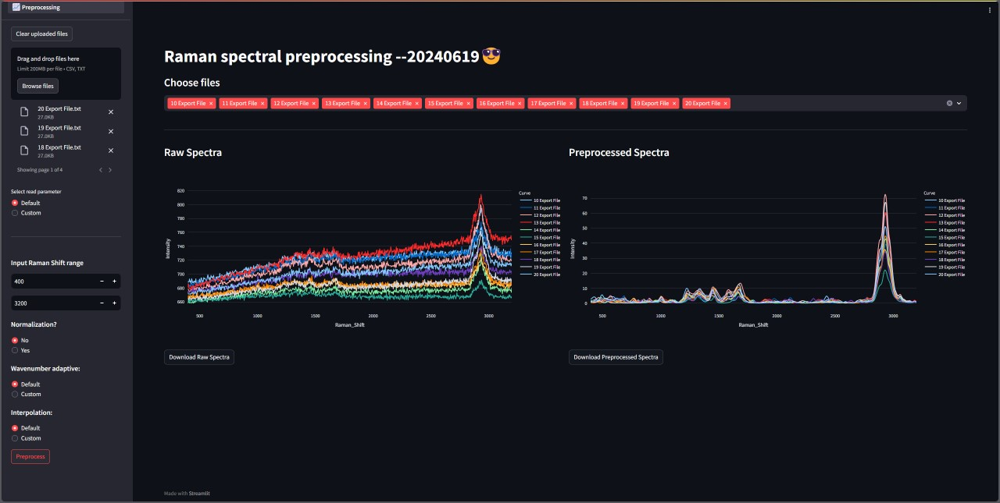

# Manual - Raman Spectral Preprocessing Model

## Website
Website: [http://150.158.140.194:6688/](http://150.158.140.194:6688/)

**Version 1.0**: 2023-12-04  Preliminary Website Functionality Completed
**Version 2.0**: 2024-06-21  We have resolved several bugs, completed the user manual, ensured compatibility with various resolution Raman spectrometers, and optimized the processing performance.

## Preface
&nbsp;&nbsp;&nbsp;&nbsp; The preprocessing of Raman spectroscopy data is highly complex, particularly in terms of baseline correction and noise reduction. For instance, when using Origin software, manual parameter adjustments are required, which are often ineffective and cannot achieve batch automation. Currently, the model has been published in related articles, and the first version of the webpage has received significant user feedback. Taking all feedback into consideration, we have further optimized the webpage to be more suitable for different instruments and samples. In this version, we have primarily considered various formats of spectral files and incorporated processing strategies that adapt to spectral resolution.

&nbsp;&nbsp;&nbsp;&nbsp; We encourage users to continue providing valuable feedback during the usage process. Additionally, for common batch processing operations such as normalization, please feel free to contact us, and we will do our best to meet your needs. Finally, as the webpage and algorithm may still contain some bugs, we appreciate your understanding and patience.

## Application object
1、Removing spectral baseline and noise in single spectra
2、Reducing Raman spectroscopy imaging time, enhancing imaging efficiency by approximately tenfold
3、Adapting to different instruments, different samples, and different spectral resolution
4、Custom port protocol to achieve custom functionalities
For details, see [Application Demonstration](#application-demonstration)


<span style="color: red;">If you find this research helpful, we encourage you to cite our paper. The citation format is as follows</span>：
Hu, J., Chen, G.J., Xue, C. et al. RSPSSL: A novel high-fidelity Raman spectral preprocessing scheme to enhance biomedical applications and chemical resolution visualization. *Light Sci Appl* 13, 52 (2024). [https://doi.org/10.1038/s41377-024-01394-5](https://doi.org/10.1038/s41377-024-01394-5)


## Contents
- [Instruction Manual - Raman Spectral Preprocessing Model](#instruction-manual---raman-spectral-preprocessing-model)
  - [Manual Authors](#manual-authors)
  - [Preface](#preface)
  - [Application object](#application-object)
  - [Contents](#contents)
  - [Introduction](#introduction)
  - [Application Demonstration](#application-demonstration)
  - [Web Usage Instructions](#web-usage-instructions)
  - [Custom Port Protocol](#custom-port-protocol)
  

<!-- This is your Markdown content before the page break -->

<div style="page-break-after: always;"></div>

<!-- This is your Markdown content after the page break -->   

## Introduction
<div style="text-align: justify;">
&nbsp;&nbsp;&nbsp;&nbsp;  Raman spectroscopy is a label-free, non-contact, and non-destructive molecular fingerprinting technique that does not require sample preparation, making it suitable for the identification and quantification of chemical substances. However, due to its low signal-to-noise ratio, Raman spectroscopy data require preprocessing, including noise reduction and baseline correction. This manual introduces a web application that integrates a deep learning preprocessing algorithm for Raman spectroscopy. It covers application demonstrations, web usage instructions, and custom port protocols.

## Application Demonstration
<div style="text-align: justify;">
&nbsp;&nbsp;&nbsp;&nbsp;  Raman spectroscopy preprocessing primarily focuses on baseline correction and noise reduction. In practical applications, we have considered the preprocessing of Raman spectra for different samples and instruments. Additionally, the preprocessing of Raman imaging data significantly reduces the required integration time.

&nbsp;&nbsp;&nbsp;&nbsp;  **1、The Effects of Preprocessing Data Acquired from Different Raman Spectrometers**


&nbsp;&nbsp;&nbsp;&nbsp;  **2、The Effects of Preprocessing Raman Spectra for Different Samples**
 

&nbsp;&nbsp;&nbsp;&nbsp;  **2、The Effects of Preprocessing Raman Hyperspectral Images**

&nbsp;&nbsp;&nbsp;&nbsp;  The above image is a trichannel pseudo-color map of spontaneous Raman spectra, demonstrating the effects of preprocessing on images with different integration times and signal-to-noise ratios. As shown, the preprocessed images exhibit higher signal-to-noise ratios, greater clarity, and are easier to analyze. Based on our statistical analysis, this method can reduce the sampling time by several orders of magnitude for a single sample, significantly improving data acquisition efficiency.


&nbsp;&nbsp;&nbsp;&nbsp;  The above image depicts the Raman spectra of 100 nm nanoparticles. Due to the small particle size, the signal is exceedingly weak, and even with prolonged integration times, the signal-to-noise ratio remains low. Our preprocessing algorithm can effectively process Raman images in such scenarios, revealing the inherent chemical information.

## Web Usage Instructions
**1、Login**

&nbsp;&nbsp;&nbsp;&nbsp;  Click <span style="color: red;">"Use Now"</span> to enter the main interface or log in with your password. The difference between visitor mode and user mode is that user mode allows for larger-scale data processing and image handling. At this stage, user mode is not yet fully updated, so please stay tuned.
**2、Format Confirmation (Optional)**

&nbsp;&nbsp;&nbsp;&nbsp;  After uploading the data, confirm whether the data format is correct. At this stage, some custom format functions are built-in. First, click <span style="color: red;">Browse files</span> to upload txt or csv files. By default, lines are read without skipping, and the supported delimiters are "\t", "," and ";". If the format is correct, the txt table will be displayed. Next, if the data format is incorrect or there are display issues, click the options box and select <span style="color: red;">"Custom"</span> to display the custom format options, where you can set custom delimiters and skip lines. Finally, click <span style="color: red;">"Plot Data"</span> to display the spectral image and confirm whether the data format is correct.

**3、Data Processing**
&nbsp;&nbsp;&nbsp;&nbsp;  Click the <span style="color: red;">"Preprocessing"</span> on the sidebar to enter the data processing interface. First, click <span style="color: red;">"Browse files"</span> to upload txt or csv files. You can select multiple files, and there is a one-click clear button at the top. The reading parameters use the default values or the parameters obtained in the previous step. Then, in the <span style="color: red;">Input Raman Shift range</span>, enter the spectral range to be processed, <span style="color: red;">ensuring the spectral range does not exceed the actual spectral range</span>. Next, choose whether to perform <span style="color: red;">Normalization</span>, currently supporting only min-max normalization. The effects are shown in the figure below, and you can export the trimmed data at this stage. You can also zoom in and out, double-click to display the spectrum, and perform other operations on the graph.


&nbsp;&nbsp;&nbsp;&nbsp;  Before starting preprocessing, you need to choose whether to enable <span style="color: red;">"Wavenumber adaptive"</span>. If you are working with biological samples and the instrument is not an ultra-high spectral resolution device, it is recommended to use the default setting. This option is primarily to accommodate different instruments and the complex background of SERS. For example, for ultra-high resolution Raman spectra, you may need to customize this setting to a range between 1000-1800. Additionally, due to the protruding background in SERS spectra, this setting can also be adjusted to 1000-1800, which can handle most SERS spectra. These parameters can be recorded for a specific type of experiment, allowing you to use them directly in future experiments without needing to retune.

Next, choose whether to perform <span style="color: red;">"Interpolation"</span>. By default, the output Raman shift matches the input. Changing this setting will interpolate the number of Raman shifts to the specified value. Finally, click <span style="color: red;">"Preprocess"</span> to start preprocessing. <span style="color: red;">
Special Note: Due to network speed and server performance limitations, please wait for a moment after starting preprocessing. The top right corner will display "running". During this time, please do not click any buttons or perform any actions to prevent the program from crashing.</span>


## Custom Port Protocol

&nbsp;&nbsp;&nbsp;&nbsp;  1、Visitor Protocol: This protocol allows direct calls to the preprocessing model, enabling custom functionality. The protocol uses HTTP, supporting GET and POST requests, and returns data in JSON format. Deployment is in progress; once completed, the port, IP address, and pairing code will be made public. However, due to server performance limitations and initial bug issues, program crashes may occur during use. We appreciate your understanding.

&nbsp;&nbsp;&nbsp;&nbsp;  2、User Protocol: This protocol allows direct calls to the preprocessing model, enabling custom functionality. The protocol uses HTTP, supporting GET and POST requests, and returns data in JSON format. For specific port, IP address, and pairing code, please contact the corresponding author. The specific protocol is as follows:{"spec": spectral data in JSON format, "window_size": integer}. The first part encapsulates the DataFrame format into JSON format, and the second part is the window size, which is an integer representing the value in the wavenumber adaptive settings mentioned above. The returned data is in JSON format:{"preprocessed spectral data": JSON format}. A specific example is as follows:
```python
import requests
import json
import pandas as pd
from hashlib import md5

def u(t):
  o = 'XXXXXXX'
  result = t.lower() + '&' + o.lower()
  return md5(result.encode()).hexdigest()

data = pd.read_csv("data.csv")
data = data.to_json(orient="split")

headers = {
  'Content-Type':'application/json',
  'u-sign': u(data)
}

url = "http://xxx.xxx.xxx.xxx:xxxx/Preprocess"

response = requests.post(url, 
                        headers=headers, 
                        data=json.dumps({"spec": data, "window_size": 1000}))
response = pd.read_json(response.text, orient="split")

```
