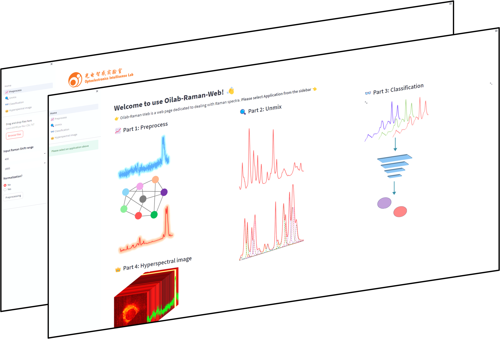
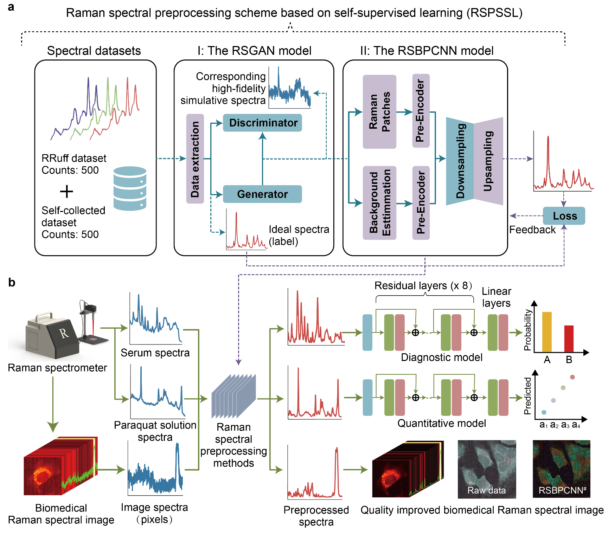

# Raman spectral preprocessing

## Website
Website: [http://8.130.110.188:6688/](http://150.158.140.194:6688/)

We have opened a user website that makes Raman spectral preprocessing easy for everyone.

## Abstract
Raman spectroscopy has tremendous potential for material analysis with its molecular fingerprinting capability in many branches of science and technology. It is also an emerging omics technique for metabolic profiling to shape precision medicine. However, precisely attributing vibration peaks coupled with specific environmental, instrumental, and specimen noise is problematic. Intelligent Raman spectral preprocessing to remove statistical bias noise and sample-related errors should provide a powerful tool for valuable information extraction. Here, we propose a novel Raman spectral preprocessing scheme based on self-supervised learning (RSPSSL) with high capacity and spectral fidelity. It can preprocess arbitrary Raman spectra without further training at a speed of ~1 900 spectra per second without human interference. The experimental data preprocessing trial demonstrated its excellent capacity and signal fidelity with an 88% reduction in root mean square error and a 60% reduction in infinite norm (L_∞) compared to established techniques. With this advantage, it remarkably enhanced various biomedical applications with a 400% accuracy elevation ($\Delta$ AUC) in cancer diagnosis, an average 38% (few-shot) and 242% accuracy improvement in paraquat concentration prediction, and unsealed the chemical resolution of biomedical hyperspectral images, especially in the spectral fingerprint region. It precisely preprocessed various Raman spectra from different spectroscopy devices, laboratories, and diverse applications. This scheme will enable biomedical mechanism screening with the label-free volumetric molecular imaging tool on organism and disease metabolomics profiling with a scenario of high throughput, cross-device, various analyte complexity, and diverse applications.  

## Introduction
Schematics of this work: the proposed self-supervised learning-based Raman spectral preprocessing (RSPSSL) scheme and the experimental design for its comprehensive performance evaluation.

## Citation Information
Hu, J., Chen, G.J., Xue, C. et al. RSPSSL: A novel high-fidelity Raman spectral preprocessing scheme to enhance biomedical applications and chemical resolution visualization. Light Sci Appl 13, 52 (2024).
https://doi.org/10.1038/s41377-024-01394-5

